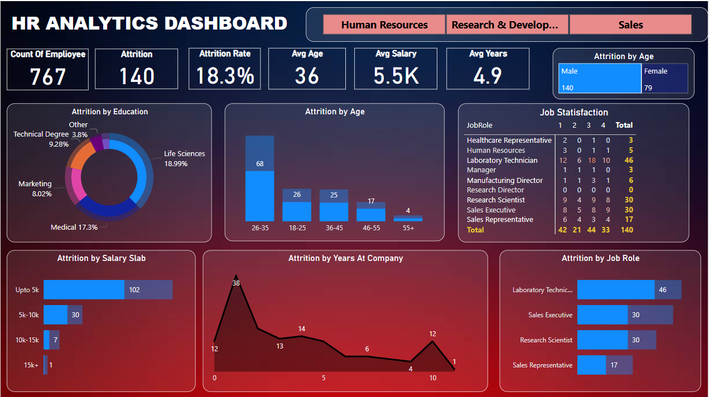

# Data Analytics Project: HR Analytics Dashboard in Power BI

## Project Overview
This HR Analytics Dashboard provides insights into employee attrition, job satisfaction, and other key workforce metrics. It helps HR teams analyze attrition trends based on education, salary, age, job roles, and years at the company.

## Table of Contents
1. [Project Description](#project-description)
2. [Features](#features)
3. [Data Sources](#data-sources)
4. [Visuals & Insights](#Visuals-Insights)
5. [Dashboard Screenshots](#dashboard-screenshots)
6. [How to use](#how-to-use)
7. [Conclusion](#conclusion)
8. [Contributors](#contributors)

## Project Description
The HR Analytics Dashboard is a comprehensive tool designed to help HR teams analyze and manage employee attrition, job satisfaction, and workforce metrics. By providing data-driven insights, it enables organizations to identify trends and take proactive steps to improve employee retention and satisfaction.

This dashboard visualizes key HR metrics such as attrition by education, salary, age, job roles, and years at the company, allowing HR professionals to make informed decisions.

## Features
- **Total Employees**: 767
- **Attrition Count**: 140 (18.3% attrition rate)
- **Average Age**: 36 years
- **Average Salary**: $5.5K
- **Average Years in Company**: 4.9 years
- **Attrition Analysis**: Breakdown by education, salary slab, job roles, age, and years at the company
- **Job Satisfaction Levels**: Based on different roles

## Data Sources
The sales data used in this project comes from the following sources:
- *HR_Analytics.csv*

## Visuals & Insights
- **Attrition by Education**: Highest attrition in Life Sciences (18.99%) and Medical (17.3%)
- **Attrition by Age**: Highest in the 26-35 age group (68 employees)
- **Attrition by Salary Slab**: Majority earning up to $5K (102 employees)
- **Attrition by Job Role**: Highest among Laboratory Technicians (46 employees)
- **Attrition by Years at Company**: Peak attrition around the 2nd year (38 employees)

## Dashboard Screenshots
Here are some screenshots from the HR Analytics Dashboard:

Dashboard Overview

## How to Use
1. Analyze employee attrition trends.
2. Identify critical areas for HR intervention.
3. Improve job satisfaction and retention strategies.

## Conclusion
This dashboard helps HR teams make data-driven decisions to reduce attrition and improve employee engagement.

## Contributors
- [PAYAL PAWAR](https://github.com/paaayall)

---
